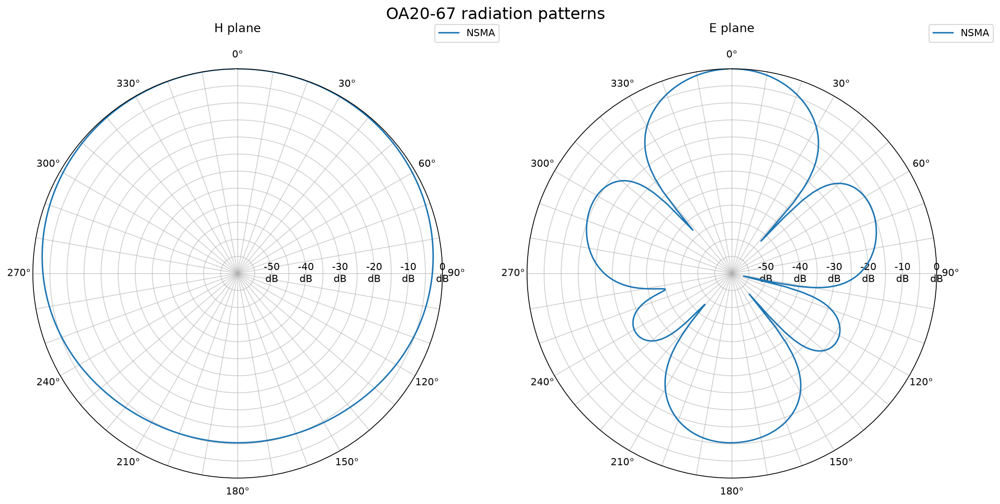

# Antenna Pattern Utilities

Python utilities for converting PLANET and EDX antenna-pattern files to NSMA
WG16.99.050, auditing and repairing NSMA files, comparing pattern data, and
producing polar radiation-pattern plots.

## Utilities

| Utility | Purpose |
| --- | --- |
| `convert_planet_to_nsma.py` | Convert PLANET `.pln` patterns to NSMA |
| `convert_edx_to_nsma.py` | Convert EDX `.pat` patterns to NSMA |
| `nsma_audit.py` | Validate NSMA structure, records, and pattern data without changing the file |
| `nsma_repair.py` | Conservatively repair supported NSMA formatting and metadata errors |
| `nsma_schema.py` | Regenerate the CSV and JSON schema reference files |

## Features

- Converts PLANET and EDX pattern data to NSMA WG16.99.050 records.
- Supports reusable metadata templates for EDX conversions.
- Audits NSMA files independently for structural and pattern-data errors.
- Repairs selected NSMA problems without overwriting the source file.
- Supports horizontal/vertical (`H`/`V`) and azimuth/elevation (`AZ`/`EL`)
  cut designators.
- Preserves pattern angles and relative gain values to three decimal places.
- Compares PLANET and NSMA cuts point by point.
- Produces separate H-plane and E-plane polar plots.
- Overlays PLANET and NSMA data with distinguishable line styles and markers.
- Automatically selects the plot's dB floor from the supplied pattern data.

## Example output



*H-plane and E-plane radiation patterns plotted from an NSMA file.*

## Requirements

- Python 3.10 or newer
- Matplotlib 3.10 or newer for plotting

### Development setup with uv

Open `antenna-pattern-utils.code-workspace` in Visual Studio Code. The workspace
recommends the Python, Pylance, and Ruff extensions and selects the project's
`.venv` interpreter.

Install the project and development tools with:

```powershell
uv sync
```

Run commands inside the managed environment with `uv run`, for example:

```powershell
uv run python nsma_audit.py antenna.nsm
uv run ruff check .
uv run ruff format --check .
```

`pyproject.toml` is the authoritative project and Ruff configuration. Commit
the generated `uv.lock` file so development and automated checks use consistent
dependency versions.

### Setup with pip

Install the Python dependency with:

```powershell
python -m pip install -r requirements.txt
```

Conversion and comparison do not import Matplotlib unless plotting is
requested.

## Converting PLANET patterns

Provide the PLANET file and its operating-band limits in MHz:

```powershell
python convert_planet_to_nsma.py YB6-61.pln --low-frequency 450 --high-frequency 480
```

This creates `YB6-61.nsm` beside the input file. Use `-o` to select another
output path:

```powershell
python convert_planet_to_nsma.py YB6-61.pln `
  -o converted-YB6-61.nsm `
  --low-frequency 450 `
  --high-frequency 480
```

If either frequency is omitted, the program requests it interactively.

The low and high frequencies should be obtained from authoritative antenna
documentation. The PLANET `FREQUENCY` field is used as the NSMA pattern
frequency (`PATFRE`), not as the full operating band.

## Converting EDX patterns

Convert an EDX Wireless `.pat` file with:

```powershell
python convert_edx_to_nsma.py antenna.pat `
  --manufacturer "RF Industries Pty Ltd" `
  --low-frequency 450 `
  --high-frequency 480 `
  --pattern-frequency 465 `
  --polarization V/V `
  -o antenna.nsm
```

EDX supplies the antenna name and maximum gain in dBi. Manufacturer,
frequencies, and polarization are required command-line metadata because they
are not included in the EDX format.

For repeated conversions, create a documented metadata template:

```powershell
python convert_edx_to_nsma.py --make-template
```

This writes `edx_nsma_template.txt`. Complete its required values, then use it
for a conversion:

```powershell
python convert_edx_to_nsma.py antenna.pat `
  --template edx_nsma_template.txt `
  -o antenna.nsm
```

To choose the generated template's path, provide it after the option, for
example `--make-template templates/rfi-yagi.txt`. Values supplied directly on
the command line override corresponding template values.

The converter supports:

- `KYPAT=1` relative field strength, converted with `20 log10(field)`
- `KYPAT=2` dB values
- Normalization of each completed NSMA plane to a maximum of 0 dBr
- Horizontal angles expressed as either 0–360 or −180 to +180 degrees
- No vertical data (`NUM_SLICES=0`, `NELV=0`)
- A full vertical plane formed from EDX 0-degree and 180-degree slices

The 0- and 180-degree elevation slices are combined before normalization so
rear-lobe attenuation is preserved. Other multi-slice 3D patterns are rejected
until their NSMA phi-cut mapping is implemented explicitly.

Comparison and plotting options are also available:

```powershell
python convert_edx_to_nsma.py antenna.pat `
  --manufacturer "RF Industries Pty Ltd" `
  --low-frequency 450 `
  --high-frequency 480 `
  --pattern-frequency 465 `
  --polarization V/V `
  --compare-nsm antenna-reference.nsm `
  --plot-output antenna-patterns.png `
  -o antenna-converted.nsm
```

## Comparing PLANET and NSMA data

Use `--compare-nsm` to verify an existing NSMA file against the PLANET source:

```powershell
python convert_planet_to_nsma.py YB6-61.pln `
  -o YB6-61.check.nsm `
  --low-frequency 450 `
  --high-frequency 480 `
  --compare-nsm YB6-61.nsm
```

The comparison checks:

- Cut designators
- Point counts
- Every pattern angle
- Every relative gain value

The default numeric tolerance is 0.0005, allowing for NSMA's three-decimal
serialization. A successful comparison exits with status 0. A failed
comparison reports up to ten differences and exits with status 1.

The output and comparison paths must be different to prevent accidental
overwriting of the reference file.

## Auditing an NSMA file

Use `nsma_audit.py` to inspect an NSMA file without changing it:

```console
python nsma_audit.py audit/problem-file.nsm
```

Multiple files may be checked in one command:

```console
python nsma_audit.py first.nsm second.nsm
```

The auditor checks:

- CRLF record endings and final-record termination
- Unexpected blank lines
- Required and duplicate records
- Standard field order and maximum record lengths
- `NUMCUT`, `NUPOIN`, and actual cut/point counts
- Pattern-point syntax
- Strictly increasing and duplicate angles
- Circularly equivalent duplicate directions such as 0/360 and -180/+180
- `FSTLST` values against the actual first and last points
- The final `ENDFIL:,EOF` record

Errors produce exit status 1, making the auditor suitable for scripts and
automated checks. Warnings identify suspicious but still readable content.

The auditor uses the immutable WG16.99.050 definitions in `nsma_standard.py`.
The `--schema` option is an advanced external CSV override; using it prints a
warning because it replaces the trusted built-in field validation.

## Repairing an NSMA file

Use `nsma_repair.py` to make conservative, traceable formatting repairs. Start
with a dry run:

```console
python nsma_repair.py audit/problem-file.nsm --dry-run
```

Write the repaired content to a new file with:

```console
python nsma_repair.py audit/problem-file.nsm -o repaired.nsm
```

The repair utility can:

- Normalize malformed, LF-only, or CR-only endings to CRLF
- Remove empty records
- Correct `REVDAT` to `19990520` for the published WG16.99.050 format
- Add trailing commas to otherwise valid pattern points
- Normalize known `PATTYP` casing
- Derive `NUPOIN` and `FSTLST` from the actual points in each cut
- Repair or insert `ELTILT`, using zero by default or values supplied with
  `--eltilt` and `--eltilt-tolerance`
- Remove duplicate `ENDFIL` records

It never overwrites the source file and will not invent missing pattern points
or unknown metadata. After writing, it runs the auditor and reports all
remaining issues. Exit status 2 means a repaired file was written but unresolved
audit errors remain.

For a known electrical tilt, supply it explicitly:

```console
python nsma_repair.py problem.nsm -o repaired.nsm --eltilt 4 --eltilt-tolerance 0.5
```

Missing or empty antenna-header metadata can be copied from a trusted NSMA file
for the same antenna. Preview every proposed value first:

```console
python nsma_repair.py problem.nsm --reference trusted.nsm --dry-run
```

Then write a repaired file:

```console
python nsma_repair.py problem.nsm --reference trusted.nsm -o repaired.nsm
```

The reference must pass the NSMA audit. Existing non-empty values are never
replaced, and frequency-block metadata, cut definitions, angles, gains, and
pattern points are never copied. Before writing, the utility displays the exact
changes and requires confirmation that the reference values apply to the target
antenna. Use `--yes` only for an intentionally reviewed, non-interactive run.

## Polar plots

Save H-plane and E-plane plots to an image:

```powershell
python convert_planet_to_nsma.py YB6-61.pln `
  -o YB6-61.check.nsm `
  --low-frequency 450 `
  --high-frequency 480 `
  --compare-nsm YB6-61.nsm `
  --plot-output YB6-61-patterns.png
```

Display the plots interactively with `--plot`:

```powershell
python convert_planet_to_nsma.py YB6-61.pln `
  --low-frequency 450 `
  --high-frequency 480 `
  --plot
```

When comparison data is supplied, PLANET patterns are solid and NSMA patterns
are dashed with sparse markers. Exact overlap provides a visual confirmation
that conversion preserved the pattern.

Plots use:

- Angular grid lines every 10 degrees
- Angular labels every 30 degrees
- Gain circles every 5 dB
- Gain labels every 10 dB along the 90-degree axis

By default, the lowest pattern value is rounded down to the next 10 dB boundary
and used as the plot floor. Override it when required:

```powershell
python convert_planet_to_nsma.py YB6-61.pln `
  --low-frequency 450 `
  --high-frequency 480 `
  --plot-floor -60 `
  --plot-output YB6-61-patterns-60db.png
```

## Cut geometry and polarization

Cut geometry and polarization are independent NSMA properties.

- `PATCUT:,H` and `PATCUT:,V` describe horizontal and vertical pattern cuts.
- `PATCUT:,AZ` and `PATCUT:,EL` describe azimuth and elevation cuts for a
  tilted or steerable antenna.
- `POLARI:,V/V` describes a vertically polarized antenna response to a
  vertically polarized illuminating signal.
- `POLARI:,H/H` is the corresponding horizontal co-polarized measurement.

The converter maps untilted PLANET `HORIZONTAL` and `VERTICAL` patterns to
NSMA `H` and `V`. A non-zero PLANET `TILT` field maps them to `AZ` and `EL`.

## Project structure

```text
antenna_models.py  Shared antenna and pattern-cut data classes
planet_parser.py   PLANET ASCII parser and cut mapping
edx_parser.py      EDX Wireless pattern parser and plane conversion
nsma.py            NSMA parsing, serialization, and comparison
nsma_standard.py   Authoritative immutable WG16.99.050 definitions
nsma_schema.py     Generates the CSV and JSON reference artifacts
plotting.py        Matplotlib polar plotting
convert_planet_to_nsma.py  Command-line interface and workflow
convert_edx_to_nsma.py     EDX-to-NSMA command-line converter
nsma_audit.py       Read-only NSMA format and structure auditor
nsma_repair.py      Conservative NSMA formatting repair utility
requirements.txt   Python plotting dependency
```

Generated reference material includes:

- `nsma.csv` and `nsma_schema.json`, generated from `nsma_standard.py`
- `data/ant.nsm`, the example supplied by the standard

Regenerate the CSV and JSON artifacts with:

```console
python nsma_schema.py
```

Do not edit `nsma.csv` or `nsma_schema.json` as authoritative inputs. Proposed
standards changes should be reviewed in `nsma_standard.py`, after which the
artifacts can be regenerated.

## References

This project was developed with reference to the National Spectrum Management
Association recommendation **WG16.99.050, Antenna Systems – Standard Format
for Digitized Antenna Patterns**:

- [NSMA Reports and Recommendations](https://www.nsma.org/recommendations/)
- [WG16.99.050 direct PDF](https://www.nsma.org/wp-content/uploads/wg1699050.pdf)

The NSMA recommendation and any referenced manufacturer datasheets, product
names, and trademarks remain the property of their respective owners. They are
not covered by this project's software license.

## Verified examples

### OA20-67

- Operating band: 400-520 MHz
- Pattern frequency: 460 MHz
- Two cuts and 720 total points

### YB6-61

- Operating band: 450-480 MHz
- Pattern frequency: 465 MHz
- Two cuts and 720 total points

For both examples, the generated NSMA pattern points match their PLANET source
data.

## Command-line reference

Each command provides detailed option and usage information:

```powershell
python convert_planet_to_nsma.py --help
python convert_edx_to_nsma.py --help
python nsma_audit.py --help
python nsma_repair.py --help
```

## License scope

The project license applies only to the source code and original documentation
in this repository. It does not apply to referenced third-party standards,
datasheets, trademarks, or manufacturer antenna data.
